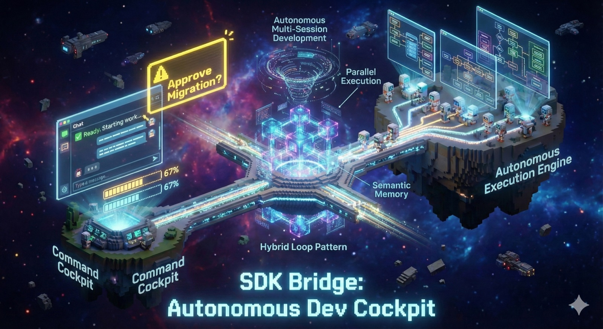

# SDK Bridge Marketplace

**Version 2.0.1** - SOTA Autonomous Development with Intelligent Generative UI

## 🎉 What's New in v2.0.1: Stable Release

**v2.0.1 Critical Bugfix** (2026-01-16): Removed UserPromptSubmit hook that blocked all operations. Plugin now works without requiring explicit approval on every prompt.

SDK Bridge v2.0 transforms from command-driven to **intelligent, proactive** experience:

### ✨ Before (v1.x): Manual Command Flow
```
/sdk-bridge:init
/sdk-bridge:handoff
tail -f .claude/sdk-bridge.log  # External monitoring
/sdk-bridge:status              # Manual polling
/sdk-bridge:resume              # Finally see results
```

### 🚀 After (v2.0): Intelligent, Guided Experience
```
/sdk-bridge:start               # Interactive setup with AskUserQuestion
                                # → TodoWrite progress tracking
                                # → Auto-launch with visibility

/sdk-bridge:watch               # Live progress updates in chat (optional)

[SessionStart Hook]             # Auto-detects completion, notifies you
                                # → Rich notification with progress bars

/sdk-bridge:resume              # Comprehensive report with:
                                # → ✅/❌ file validation
                                # → Git commits analysis
                                # → Speedup calculations
```

**Context-aware help** via prompt hooks - ask questions naturally, get intelligent guidance!

---

## Overview

**sdk-bridge** seamlessly bridges Claude Code CLI with the Claude Agent SDK for long-running autonomous development. Perfect for projects requiring hours or days of autonomous work.

**SOTA features**: Hybrid loops, semantic memory, parallel execution, adaptive intelligence, human-in-the-loop approvals, and now **generative UI** for delightful user experience.

---

## Features

### 🎨 Generative UI (NEW in v2.0)

- **Interactive Onboarding** (`/start`): AskUserQuestion-driven setup
  - Model selection (Sonnet vs Opus)
  - Parallel execution toggle
  - Advanced features multi-select
  - TodoWrite progress tracking throughout

- **Live Progress** (`/watch`): Real-time updates in chat
  - 30-second polling with TodoWrite updates
  - Progress bars, completion percentages
  - Simulated "live" experience

- **Intelligent Resume**: Comprehensive completion reports
  - Executive summary with visual progress
  - Feature-by-feature breakdown
  - ✅/❌ Deliverable file validation
  - Git commits analysis
  - Speedup calculations for parallel mode

- **Proactive Notifications**: SessionStart hook auto-detects completion
  - Rich visual formatting (emojis, bars, separators)
  - Context-aware messaging
  - Clear call-to-action

### 🤖 Core Autonomous Development

- **Autonomous Multi-Session Development**: Hand off to SDK agent for independent feature implementation
- **Hybrid Loop Pattern** (v2.0 Phase 1): Same-session self-healing + multi-session progression (60% cost reduction)
- **Semantic Memory** (v2.0 Phase 1): Cross-project learning from past successful implementations
- **Adaptive Model Selection** (v2.0 Phase 2): Smart Sonnet/Opus routing based on complexity, risk, and past failures
- **Parallel Execution** (v2.0 Phase 3): Dependency-aware parallel feature implementation (2-4x speedup)
- **Approval Workflow** (v2.0 Phase 2): Human-in-the-loop for high-risk operations (non-blocking)
- **File Validation** (v1.8.1): Verifies deliverables exist (no phantom completions)

### 📊 User Experience Excellence

- **Progress Tracking**: Real-time status with live updates via `/watch`
- **Graceful Handoff/Resume**: Seamless CLI ↔ SDK transitions with full state preservation
- **Validation**: Pre-handoff checks ensure environment readiness
- **Comprehensive Reporting**: Detailed completion reports with achievements, issues, recommendations
- **File-Based State Management**: Reliable state sharing between CLI and SDK
- **Visual Feedback**: Progress bars, emojis, separators for engaging experience

---

## Installation

### From flight505-marketplace (Recommended)

```bash
# Add marketplace
/plugin marketplace add flight505/flight505-marketplace

# Install plugin
/plugin install sdk-bridge@flight505-marketplace
```

### From standalone marketplace

```bash
# Add marketplace
/plugin marketplace add flight505/sdk-bridge-marketplace

# Install plugin
/plugin install sdk-bridge@sdk-bridge-marketplace
```

See [INSTALLATION.md](./INSTALLATION.md) for detailed installation instructions and troubleshooting.

---

## Quick Start (v2.0)

### 1. Setup Harness (First Time Only)

```bash
/sdk-bridge:lra-setup
```

Installs 7 harness scripts to `~/.claude/skills/`:
- `autonomous_agent.py` (v1.4.0 core)
- `hybrid_loop_agent.py` (v2.0 - hybrid loops)
- `semantic_memory.py` (cross-project learning)
- `model_selector.py` (adaptive Sonnet/Opus routing)
- `approval_system.py` (risk assessment & approvals)
- `dependency_graph.py` (parallel execution planning)
- `parallel_coordinator.py` (multi-worker orchestration)

Verifies `claude-agent-sdk` is installed.

### 2. Create Feature Plan

```bash
/plan
```

Describe your project vision → generates `feature_list.json` with all features.

### 3. Start Autonomous Development ⭐ NEW

```bash
/sdk-bridge:start
```

**Interactive setup** with AskUserQuestion:
1. **Model**: Choose Sonnet (fast, cost-effective) or Opus (complex tasks)
2. **Parallel Mode**: Enable if you ran `/sdk-bridge:plan` (2-4x speedup)
3. **Advanced Features**: Select from Semantic Memory, Adaptive Models, Approvals

**TodoWrite** shows progress:
- ✅ Prerequisites validated
- ✅ Configuration created
- ✅ Validation passed
- ✅ Agent launched (PID: 12345)

**Result**: Agent launches with full visibility, estimated completion time, and next steps.

### 4. Monitor Progress (Optional)

```bash
/sdk-bridge:watch
```

Watch live updates for 30 seconds with TodoWrite progress bars and feature status.

**Or check status anytime**:
```bash
/sdk-bridge:status
```

**Or view logs**:
```bash
tail -f .claude/sdk-bridge.log
```

### 5. Review Completion

When complete, **SessionStart hook** notifies you automatically with rich visual summary:

```
🎉 SDK Agent Completed!

10/10 features (100%)
[████████████████████] 100%
45 minutes (3x faster with parallel)

/sdk-bridge:resume to review
```

**Then review work**:
```bash
/sdk-bridge:resume
```

**Comprehensive report** with:
- 📊 Executive summary with progress bars
- 📋 Feature-by-feature breakdown
- 📦 ✅/❌ Deliverable file validation
- 📝 Git commits since handoff
- ⚡ Speedup calculations (parallel mode)
- 🎯 Next steps guidance

---

## Commands (12 Total)

### Primary Workflow (v2.0 SOTA)

| Command | Description |
|---------|-------------|
| `/sdk-bridge:lra-setup` | Install harness scripts (first time only) |
| `/sdk-bridge:start` | ⭐ Interactive onboarding + launch (replaces init + handoff) |
| `/sdk-bridge:watch` | ⭐ Live progress updates with TodoWrite (30 sec polling) |
| `/sdk-bridge:status` | Check current agent status |
| `/sdk-bridge:resume` | ⭐ Comprehensive completion report with file validation |
| `/sdk-bridge:cancel` | Stop running agent |

### Advanced Workflow (Power Users)

| Command | Description |
|---------|-------------|
| `/sdk-bridge:init` | Create configuration manually (for customization) |
| `/sdk-bridge:handoff` | Launch agent manually (for advanced control) |
| `/sdk-bridge:plan` | Analyze dependencies for parallel execution |
| `/sdk-bridge:enable-parallel` | Enable parallel mode after planning |
| `/sdk-bridge:approve` | Review and approve high-risk operations |
| `/sdk-bridge:observe` | Experimental: Real-time dashboard (future) |

---

## Advanced Features

### Parallel Execution (v2.0 Phase 3)

Enable 2-4x speedup for independent features:

```bash
# 1. Analyze dependencies
/sdk-bridge:plan

# 2. Review execution plan
cat .claude/execution-plan.json

# 3. Enable parallel mode
/sdk-bridge:enable-parallel

# 4. Start (will use parallel mode automatically)
/sdk-bridge:start
```

Features are executed in levels based on dependencies. Git-isolated workers run concurrently.

### Semantic Memory (v2.0 Phase 1)

Cross-project learning suggests solutions from past successful implementations:

```yaml
# In .claude/sdk-bridge.local.md
enable_semantic_memory: true
```

Automatically suggests patterns when similar features detected.

### Adaptive Models (v2.0 Phase 2)

Smart Sonnet/Opus routing based on complexity and risk:

```yaml
# In .claude/sdk-bridge.local.md
enable_adaptive_models: true
```

- Sonnet: Standard features (90% of work)
- Opus: Complex refactoring, architectural changes, retry failures

### Approval Workflow (v2.0 Phase 2)

Human-in-the-loop for high-risk operations:

```yaml
# In .claude/sdk-bridge.local.md
enable_approval_nodes: true
```

Pauses for:
- Database migrations
- API changes with breaking potential
- Architectural refactors
- Security-sensitive operations

Non-blocking: Other features continue while waiting for approval.

---

## Configuration

Configuration stored in `.claude/sdk-bridge.local.md`:

```yaml
---
# Basic Settings
enabled: true
model: claude-sonnet-4-5-20250929  # or claude-opus-4-5-20251101
max_sessions: 20
reserve_sessions: 2
log_level: INFO

# v2.0 Advanced Features
enable_v2_features: true
enable_semantic_memory: true
enable_adaptive_models: true
enable_approval_nodes: true
max_inner_loops: 5  # Same-session retries

# v2.0 Phase 3: Parallel Execution
enable_parallel_execution: false  # Enable via /enable-parallel
max_parallel_workers: 3
---
```

See [Configuration Reference](./plugins/sdk-bridge/skills/sdk-bridge-patterns/references/configuration.md) for all options.

---

## Architecture

### Two-Agent Harness Pattern

**CLI Agent** (Claude Code):
- Interactive commands, user-facing
- Validates prerequisites, creates configuration
- Monitors progress, reviews completion
- Uses hooks for proactive notifications

**SDK Agent** (subprocess):
- Autonomous execution in background
- Multi-session loop with state persistence
- Advanced features (hybrid loops, semantic memory, parallel execution)
- File-based communication with CLI

### State Management

File-based state sharing between CLI and SDK:

- `.claude/sdk-bridge.local.md` - Configuration with YAML frontmatter
- `.claude/handoff-context.json` - Handoff metadata
- `.claude/sdk-bridge.pid` - Process ID
- `.claude/sdk-bridge.log` - Execution logs
- `.claude/sdk_complete.json` - Completion signal
- `feature_list.json` - Source of truth (only `passes` field updated)
- `claude-progress.txt` - Session-to-session memory

### Generative UI Components (v2.0)

**AskUserQuestion**: Interactive setup with 1-4 questions, multiSelect support
**TodoWrite**: Real-time progress tracking with 3 states (pending, in_progress, completed)
**Prompt Hooks**: LLM-driven decision making for context-aware behavior

---

## Documentation

- **[INSTALLATION.md](./INSTALLATION.md)** - Detailed installation guide with troubleshooting
- **[CLAUDE.md](./CLAUDE.md)** - Developer guide for plugin development
- **Skill Guide**: `/sdk-bridge-patterns` - Comprehensive 2800+ line guide (auto-loads when needed)
- **State Files**: [Reference](./plugins/sdk-bridge/skills/sdk-bridge-patterns/references/state-files.md)
- **Configuration**: [Reference](./plugins/sdk-bridge/skills/sdk-bridge-patterns/references/configuration.md)
- **Workflow Example**: [TaskFlow 3-day build](./plugins/sdk-bridge/skills/sdk-bridge-patterns/examples/workflow-example.md)
- **Scenarios**: [10 common scenarios](./plugins/sdk-bridge/skills/sdk-bridge-patterns/examples/handoff-scenarios.md)

---

## Recent Releases

### v2.0.1 (2026-01-16) - Critical Bugfix

**Critical Fix**: Removed UserPromptSubmit hook that blocked all operations

**Issue**: Prompt-based hook triggered Claude Code security protocols, requiring explicit user approval on every prompt

**Resolution**:
- Removed UserPromptSubmit hook from hooks.json
- Removed reference to non-existent monitor-progress.sh
- Use `/sdk-bridge:watch` or `/sdk-bridge:status` for progress monitoring

### v2.0.0 (2026-01-11) - SOTA Generative UI Transformation

**Major UX Overhaul** - Intelligent, proactive experience:

**NEW Commands**:
- `/sdk-bridge:start` - Interactive onboarding with AskUserQuestion + TodoWrite
- `/sdk-bridge:watch` - Live progress polling with visual updates

**ENHANCED Commands**:
- `/sdk-bridge:resume` - Comprehensive report with ✅/❌ file validation, git analysis, speedup calculations

**NEW Hooks**:
- SessionStart (prompt-based) - Rich completion notifications with LLM analysis

**Impact**: 67% reduction in commands to start, live visibility, proactive guidance, no phantom completions

### v1.9.0 (2026-01-11) - Phase 3 Complete: Parallel Execution

- **Parallel Execution**: 2-4x speedup with multi-worker orchestration
- **Auto-Detection**: Intelligent mode selection (parallel vs sequential)
- **Commands**: `/enable-parallel` for opt-in workflow
- **Integration**: Seamless fallback to sequential if no plan

### v1.8.1 (2026-01-11) - File Validation

- **Deliverable Validation**: Verifies files exist (no phantom completions)
- **Troubleshooting**: Guidance for missing files

### v1.7.0-1.8.0 - v2.0 Features Foundation

- **Hybrid Loops** (Phase 1): Same-session self-healing
- **Semantic Memory** (Phase 1): Cross-project learning
- **Adaptive Models** (Phase 2): Smart Sonnet/Opus routing
- **Approval Workflow** (Phase 2): Human-in-the-loop for high-risk ops

---

## Support

- **Issues**: [GitHub Issues](https://github.com/flight505/sdk-bridge-marketplace/issues)
- **Documentation**: [SDK Bridge Patterns Skill](./plugins/sdk-bridge/skills/sdk-bridge-patterns/SKILL.md)
- **Repository**: [github.com/flight505/sdk-bridge-marketplace](https://github.com/flight505/sdk-bridge-marketplace)
- **Author**: [Jesper Vang](https://github.com/flight505)

---

## License

MIT License - See [LICENSE](./LICENSE) for details

---

**Built with ❤️ by Jesper Vang**

**Powered by Claude Code & Claude Agent SDK** 🚀
