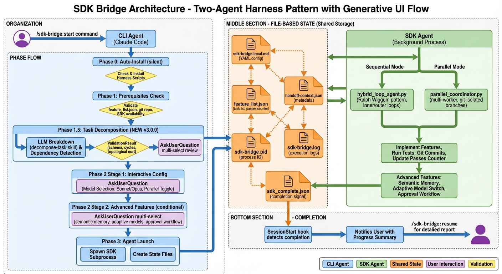

# SDK Bridge

**Version 3.0.0** - End-to-End Autonomous Development Assistant

**SDK Bridge** is a Claude Code plugin that turns your project descriptions into working software. Describe what you want to build in natural language, and SDK Bridge breaks it down into tasks, orders them correctly, and implements everything autonomously while you work on other things.

---

## 🎯 Quick Start (ELI5 - Explain Like I'm 5)

**Think of SDK Bridge like hiring a really smart assistant who can code:**

1. **You describe what you want**: "I need a website with user login and a dashboard"
2. **SDK Bridge breaks it down**: Automatically creates a list of tasks (setup database, create login form, build dashboard, etc.)
3. **SDK Bridge works independently**: Goes away and implements everything over several hours or days
4. **You get notified when done**: Comes back with everything built and tested

**One command to start everything:**
```bash
/sdk-bridge:start
```

SDK Bridge will ask you a few questions (which model to use, enable advanced features), then handle the rest automatically.

**What makes it special:**
- ✅ **No manual planning required** - Just describe your goal in plain English
- ✅ **Runs independently** - Doesn't need you to stay in Claude Code
- ✅ **Learns from mistakes** - Automatically retries when things fail
- ✅ **Works on multiple tasks at once** - Can parallelize independent features
- ✅ **Asks permission for risky stuff** - Won't delete your database without asking

---

## 📦 Installation

### From flight505-marketplace (Recommended)

```bash
# Add marketplace
/plugin marketplace add flight505/flight505-marketplace

# Install plugin
/plugin install sdk-bridge@flight505-marketplace
```

### From standalone marketplace

```bash
# Add marketplace
/plugin marketplace add flight505/sdk-bridge-marketplace

# Install plugin
/plugin install sdk-bridge@sdk-bridge-marketplace
```

See [INSTALLATION.md](./INSTALLATION.md) for detailed installation instructions and troubleshooting.

---

## 🚀 Getting Started

### Step 1: Describe Your Project

Just run:
```bash
/sdk-bridge:start
```

You'll be asked: **"What would you like to build?"**

Describe your project naturally:
- "Build a REST API for managing todos with authentication"
- "Add a user profile page with avatar upload to my React app"
- "Create a database schema for an e-commerce platform"

### Step 2: Review & Customize

SDK Bridge will:
1. **Break down your description** into specific features (5-25 tasks)
2. **Show you the plan** with interactive checkboxes
3. **Let you edit/remove** any features you don't want
4. **Ask configuration questions**:
   - Which AI model to use (Sonnet is faster, Opus is smarter)
   - Enable advanced features (memory, parallel execution, approvals)

### Step 3: Launch & Monitor

SDK Bridge launches in the background and:
- ✅ Implements each feature one by one
- ✅ Runs tests after each change
- ✅ Commits to git automatically
- ✅ Learns from failures and retries
- ✅ Asks permission before risky operations

**Check progress anytime:**
```bash
/sdk-bridge:status      # Quick check
/sdk-bridge:watch       # Live updates for 30 seconds
/sdk-bridge:observe     # See recent logs
```

### Step 4: Review Completion

When done, you'll get a notification with a summary. Then review:
```bash
/sdk-bridge:resume
```

You'll see:
- 📊 Progress summary (8/10 features completed)
- 📋 Feature-by-feature breakdown
- 📦 File validation (✅ all files created)
- 📝 Git commits made
- ⚡ Time saved (if parallel mode was used)

---

## 🏗️ How It Works

SDK Bridge implements a sophisticated multi-phase architecture that handles everything from task decomposition to autonomous execution:



*Complete architecture diagram showing the two-agent harness pattern, phase progression, file-based state management, and execution modes.*

<details>
<summary><strong>🎨 Two-Stage Interactive Configuration</strong></summary>

SDK Bridge uses a **progressive disclosure** pattern to keep setup simple while offering power user options.

### Stage 1: Essential Settings (Everyone)

When you run `/sdk-bridge:start`, you'll see:

**Question 1: "What would you like to build?"**
- Three input modes:
  - Direct description (type it in)
  - Markdown file path (e.g., `requirements.md`)
  - File + specific focus (e.g., `project-plan.md "focus on authentication"`)

**Question 2: "Select features to implement"** (if decomposition runs)
- Checkbox interface with arrow key navigation
- Review the AI-generated features
- Uncheck anything you don't want
- Features are already in dependency order

**Question 3: "Which model?"**
- **Sonnet 4.5** (Recommended) - Fast, cost-effective, handles 90% of work
- **Opus 4.5** - More capable, for complex architectural changes

**Question 4: "Enable parallel execution?"**
- **Yes** - Runs independent features concurrently (2-4x faster)
- **No** - Sequential execution (simpler, safer)

### Stage 2: Advanced Settings (Optional - Power Users)

**Only shown if you chose "Yes" to parallel execution:**

**Question 5: "Select advanced features"** (multi-select with checkboxes)
- ✅ **Semantic Memory** (Recommended) - Learn from past successful implementations
- ✅ **Adaptive Models** (Recommended) - Auto-switch to Opus for complex tasks
- ✅ **Approval Workflow** - Pause before risky operations (migrations, API changes)

**Why two stages?**
- **Beginners** see 3-4 simple questions → start coding in 30 seconds
- **Experts** see all options → full control over execution strategy
- **Progressive disclosure** - complexity revealed only when needed

</details>

<details>
<summary><strong>🧠 What Happens Underneath (The Magic)</strong></summary>

When you hit enter after answering the questions, SDK Bridge does a lot of work behind the scenes:

### Phase 0: Silent Auto-Installation
- Checks if harness scripts are installed
- Quietly installs them if needed (no prompts)
- Verifies Python environment

### Phase 1: Prerequisites Check
- ✅ Validates `feature_list.json` exists (or creates it)
- ✅ Checks git repository is initialized
- ✅ Verifies claude-agent-sdk is available

### Phase 1.5: Intelligent Task Decomposition (NEW in v3.0.0)

**If you don't have a feature_list.json yet:**

1. **LLM-Powered Breakdown**
   - Sends your description to Claude with software engineering principles
   - Uses the `decompose-task` skill for structured thinking:
     - Infrastructure layer (database, auth, APIs)
     - Data layer (models, schemas, migrations)
     - Logic layer (business rules, services)
     - Interface layer (UI, endpoints, CLI)
   - Generates 5-25 specific, testable features

2. **Dependency Detection**
   - Analyzes which features depend on others
   - Example: "User login" must come before "User profile"
   - Builds a directed graph of dependencies

3. **Computational Validation**
   - **Schema validation**: Every feature has required fields
   - **Duplicate detection**: No redundant tasks
   - **Circular dependency check**: Ensures no impossible ordering
   - **Topological sorting**: Orders tasks so dependencies run first
   - **Granularity check**: Not too big (>50 features) or too small (<3 features)

4. **Interactive Review**
   - Shows you all features with checkboxes
   - You can uncheck features you don't want
   - Already sorted in dependency order

5. **Creates feature_list.json**
   ```json
   {
     "version": "2.0.0",
     "features": [
       {
         "id": "feat-001",
         "description": "Set up Express.js server with basic routing",
         "priority": 10,
         "tags": ["backend", "infrastructure"],
         "acceptance_criteria": ["Server starts on port 3000", "GET / returns 200"],
         "dependencies": [],
         "passes": 0
       },
       {
         "id": "feat-002",
         "description": "Add JWT authentication middleware",
         "priority": 9,
         "tags": ["backend", "security"],
         "dependencies": ["feat-001"],
         "passes": 0
       }
     ]
   }
   ```

### Phase 2: Configuration & Validation
- Creates `.claude/sdk-bridge.local.md` with your settings
- Validates configuration schema
- Runs pre-handoff checks (8 validation points)

### Phase 3: Agent Launch
- Spawns SDK agent as background process
- Saves PID to `.claude/sdk-bridge.pid`
- Redirects logs to `.claude/sdk-bridge.log`
- Returns control to you immediately

**All of this happens in 5-10 seconds. You just see:**
```
✅ Prerequisites validated
✅ Task decomposition completed (15 features)
✅ Configuration created
✅ Validation passed
✅ Agent launched (PID: 12345)
```

</details>

<details>
<summary><strong>📋 What is feature_list.json?</strong></summary>

`feature_list.json` is the **source of truth** for what SDK Bridge should build. Think of it as:
- **A to-do list for the AI** - Each item is one feature to implement
- **Ordered correctly** - Dependencies are handled (can't login before database exists)
- **Trackable progress** - The `passes` field increments as features complete

### Structure

```json
{
  "version": "2.0.0",
  "features": [
    {
      "id": "feat-001",                        // Unique identifier
      "description": "Set up database schema", // What to build
      "priority": 10,                          // Higher = more important
      "tags": ["backend", "database"],         // Categories
      "acceptance_criteria": [                 // How to verify it works
        "Users table exists",
        "Can insert/query users"
      ],
      "dependencies": [],                      // Must complete before this
      "estimated_effort": "medium",           // Complexity hint
      "passes": 0                             // How many times attempted
    }
  ]
}
```

### How It's Used

**Before v3.0.0**: You had to create this manually (tedious!)

**v3.0.0+**: SDK Bridge creates it automatically from your description

**During execution**:
- SDK reads the list sequentially (or in parallel if enabled)
- Implements each feature
- Increments `passes` counter
- Moves to next feature
- When all features have `passes > 0`, job is complete

**After completion**:
- You still have the file for reference
- Can see exactly what was built
- Can add more features and re-run

### Where It Lives

`feature_list.json` lives in your project root (same directory as `package.json` or `README.md`).

SDK Bridge never deletes it - it's yours to keep, edit, or extend.

</details>

---

## 📚 Commands

### Primary Workflow

| Command | Description |
|---------|-------------|
| `/sdk-bridge:start` | ⭐ **RECOMMENDED** - Interactive setup with decomposition & launch |
| `/sdk-bridge:watch` | Live progress updates (30 sec polling with visual bars) |
| `/sdk-bridge:status` | Quick status check (non-blocking) |
| `/sdk-bridge:resume` | Comprehensive completion report with file validation |
| `/sdk-bridge:cancel` | Stop running agent |

### Advanced Commands

| Command | Description |
|---------|-------------|
| `/sdk-bridge:decompose` | Task decomposition from natural language (standalone) |
| `/sdk-bridge:plan` | Analyze dependencies for parallel execution |
| `/sdk-bridge:approve` | Review and approve pending high-risk operations |
| `/sdk-bridge:observe` | Tail the last 50 lines of execution logs |
| `/sdk-bridge:enable-parallel` | Enable parallel mode (requires `/plan` first) |

---

## ⚡ Advanced Features

<details>
<summary><strong>🔄 Parallel Execution (2-4x Speedup)</strong></summary>

When you enable parallel execution, SDK Bridge:

1. **Analyzes your feature_list.json** for dependencies
2. **Groups features into levels**:
   - Level 0: No dependencies (can run first)
   - Level 1: Depends only on Level 0
   - Level 2: Depends on Level 0 or Level 1, etc.
3. **Runs multiple features concurrently** within each level
4. **Uses git isolation** - each worker on separate branch
5. **Merges when complete** - automatic conflict resolution

**Example:**
```
Level 0: [Database setup] → 15 minutes
Level 1: [User model, Product model] → 15 minutes (parallel!)
Level 2: [Authentication, Checkout] → 15 minutes (parallel!)

Sequential: 60 minutes
Parallel: 25 minutes (2.4x faster)
```

**Enable it:**
```bash
/sdk-bridge:plan    # Creates execution-plan.json
/sdk-bridge:start   # Detects plan and offers parallel mode
```

</details>

<details>
<summary><strong>🧠 Semantic Memory (Cross-Project Learning)</strong></summary>

SDK Bridge remembers solutions from past projects:

- **Stores successful implementations** in SQLite database
- **Matches similar features** using TF-IDF similarity
- **Suggests proven patterns** when implementing new features

**Example:**
```
Current feature: "Add user authentication with JWT"

Semantic memory finds:
✅ "JWT authentication in ExpressJS" (from ProjectA, 3 months ago)
✅ "User login with tokens" (from ProjectB, 1 week ago)

Suggests: "Use passport-jwt middleware pattern that worked in ProjectA"
```

**Enable it:**
- Automatically enabled by default in v3.0.0
- Disable by unchecking in advanced features

</details>

<details>
<summary><strong>🎯 Adaptive Model Selection</strong></summary>

SDK Bridge chooses between Sonnet and Opus automatically:

**Sonnet 4.5** (default):
- Standard CRUD operations
- UI components
- Test writing
- Documentation
- 90% of typical work

**Opus 4.5** (escalated):
- Complex architectural changes
- Database migrations
- Security-critical features
- Features that failed 2+ times with Sonnet

**Saves costs** while maintaining quality:
- Sonnet: ~$3 per 1M input tokens
- Opus: ~$15 per 1M input tokens
- Average savings: 60% compared to always using Opus

</details>

<details>
<summary><strong>🛡️ Approval Workflow (Human-in-the-Loop)</strong></summary>

For high-risk operations, SDK Bridge pauses and asks permission:

**Triggers approval for:**
- Database schema changes
- API breaking changes
- File deletions
- Dependency updates
- Security-related modifications

**Non-blocking:**
- Other features continue while waiting for approval
- You run `/sdk-bridge:approve` when ready
- See impact analysis before deciding

**Example:**
```bash
/sdk-bridge:approve

⚠️  High-Risk Operation Detected:

Feature: "Migrate users table to add email verification"

Risk Level: HIGH
Reason: Database migration with potential data loss

Impact:
- Adds 'email_verified' column to users table
- Requires migration script in production
- Affects 10,000+ existing user records

Alternatives:
1. Add column with default value (safer)
2. Create new table for verification (zero downtime)

Approve? [y/N]
```

</details>

---

## 🔧 Technical Deep Dive

<details>
<summary><strong>🏗️ Architecture</strong></summary>

SDK Bridge implements Anthropic's **two-agent harness pattern**:

### CLI Agent (Claude Code)
- **Role**: User interface and orchestration
- **Location**: Runs inside Claude Code CLI
- **Responsibilities**:
  - Interactive commands (`/sdk-bridge:start`, etc.)
  - Prerequisites validation
  - Progress monitoring
  - Completion reporting
  - Proactive notifications (SessionStart hook)

### SDK Agent (Background Process)
- **Role**: Autonomous implementation
- **Location**: Runs as independent Python subprocess
- **Responsibilities**:
  - Multi-session execution loop
  - Feature implementation
  - Test running
  - Git commits
  - Self-healing (retry failed features)
  - Advanced features (parallel, memory, approvals)

### Communication: File-Based State

Both agents communicate via files in `.claude/` directory:

| File | Purpose | Managed By |
|------|---------|------------|
| `sdk-bridge.local.md` | Configuration (YAML frontmatter) | CLI creates, SDK reads |
| `handoff-context.json` | Handoff metadata | CLI creates, SDK updates |
| `sdk-bridge.pid` | Process ID | CLI creates, SDK maintains |
| `sdk-bridge.log` | Execution logs | SDK writes, CLI reads |
| `sdk_complete.json` | Completion signal | SDK creates |
| `feature_list.json` | Features to build | CLI creates, SDK updates (`passes` field) |
| `claude-progress.txt` | Session memory log | SDK appends |

**Why file-based?**
- **Process isolation**: SDK can run for days independently
- **Resilient**: Survives Claude Code restarts
- **Debuggable**: All state is human-readable
- **Simple**: No network protocols or databases needed

</details>

<details>
<summary><strong>⚙️ Execution Modes</strong></summary>

SDK Bridge has two execution modes:

### Sequential Mode (Default)

**Harness**: `hybrid_loop_agent.py`

**Pattern**: "Ralph Wiggum" (same-session self-healing)
- Inner loop: Tries to fix errors without starting new session
- Outer loop: Multi-session progression through features
- Cost savings: 60% vs always creating new sessions

**Flow**:
```
For each feature:
  Try to implement (inner loop, max 5 attempts)
    - If error: analyze, fix, retry (same session)
    - If stuck: escalate to outer loop (new session)
  Run tests
  Commit to git
  Increment passes
  Move to next feature
```

### Parallel Mode (Opt-In)

**Harness**: `parallel_coordinator.py`

**Pattern**: Multi-worker orchestration with git isolation

**Flow**:
```
Load execution-plan.json
For each level (dependency layer):
  Spawn N workers (max_parallel_workers)
  Each worker:
    - Checkout feature branch
    - Implement feature(s) for this level
    - Run tests
    - Commit
  Wait for level completion
  Merge all feature branches to main
  Move to next level
```

**Git Isolation**:
```
main
├── feat-001-branch (worker 1)
├── feat-002-branch (worker 2)
└── feat-003-branch (worker 3)

After level completes:
→ Merge feat-001 to main
→ Merge feat-002 to main
→ Merge feat-003 to main
```

**Mode Detection** (automatic):
- Checks `.claude/sdk-bridge.local.md` for `enable_parallel_execution: true`
- Verifies `.claude/execution-plan.json` exists
- Falls back to sequential if any check fails

</details>

<details>
<summary><strong>🔍 Validation Pipeline</strong></summary>

SDK Bridge validates at multiple stages:

### 1. Pre-Decomposition Validation

**Input validation**:
- Description not empty
- File exists if file path provided
- File readable if specified

### 2. Post-Decomposition Validation

**Schema validation** (`ValidationResult` class):
```python
✓ Required fields: id, description, priority, tags
✓ No duplicate IDs
✓ Priority is integer 1-10
✓ Tags is non-empty array
✓ Acceptance criteria is array
✓ Dependencies reference valid IDs
```

**Dependency validation**:
```python
✓ No circular dependencies (A → B → C → A)
✓ All dependency IDs exist in feature list
✓ Dependency graph is acyclic (DAG)
```

**Topological sorting**:
```python
✓ Features ordered so dependencies run first
✓ Level assignment for parallel execution
✓ Critical path calculation
```

**Granularity validation**:
```python
✓ Feature count: 3-50 (sweet spot: 5-25)
✓ Description length: 10-200 chars per feature
✓ Dependency depth: max 5 levels
```

### 3. Pre-Handoff Validation

**8-point checklist** (handoff-validator agent):
```
✓ feature_list.json exists and valid
✓ Git repository initialized
✓ No uncommitted changes (clean working tree)
✓ Claude Agent SDK available
✓ CLAUDE_CODE_OAUTH_TOKEN or ANTHROPIC_API_KEY set
✓ Python 3.8+ available
✓ Harness scripts installed
✓ Config file valid YAML
```

### 4. Post-Completion Validation

**File validation** (resume command):
```
For each feature:
  ✓ Expected deliverables exist
  ✓ Files are not empty
  ✓ File extensions match (.py, .js, .ts, etc.)
```

**Git validation**:
```
✓ Commits made since handoff
✓ Commit messages reference features
✓ No uncommitted changes
```

</details>

<details>
<summary><strong>📊 State Machine & Phase Flow</strong></summary>

SDK Bridge follows a state machine pattern:

```
┌─────────────────┐
│  User Request   │
└────────┬────────┘
         ↓
┌─────────────────┐
│   Phase 0:      │
│ Auto-Install    │──→ Silent (no prompts)
└────────┬────────┘
         ↓
┌─────────────────┐
│   Phase 1:      │
│ Prerequisites   │──→ Check environment
└────────┬────────┘
         ↓
      [Has feature_list.json?]
         ├─ No  ──→ Phase 1.5: Decomposition ──→ AskUserQuestion (multi-select review)
         └─ Yes ──→ Skip to Phase 2
         ↓
┌─────────────────┐
│   Phase 2:      │
│ Configuration   │──→ Two-stage AskUserQuestion
│   (Stage 1)     │    • Model selection
│                 │    • Parallel toggle
└────────┬────────┘
         ↓
    [Parallel enabled?]
         ├─ No  ──→ Skip Stage 2
         └─ Yes ──→ Phase 2 (Stage 2): Advanced features (AskUserQuestion multi-select)
         ↓
┌─────────────────┐
│   Phase 2:      │
│   Validation    │──→ Pre-handoff checks
└────────┬────────┘
         ↓
┌─────────────────┐
│   Phase 3:      │
│ Agent Launch    │──→ Spawn SDK subprocess
└────────┬────────┘
         ↓
┌─────────────────┐
│ Background      │
│ Execution       │──→ SDK runs independently
└────────┬────────┘
         ↓
┌─────────────────┐
│  Completion     │──→ SessionStart hook notifies
└────────┬────────┘
         ↓
┌─────────────────┐
│ User Review     │──→ /sdk-bridge:resume
└─────────────────┘
```

**State transitions** are gated:
- Phase 1 → Phase 1.5: `if not feature_list.json`
- Phase 1.5 → Phase 2: `if decomposition succeeded`
- Phase 2 Stage 1 → Stage 2: `if parallel_enabled`
- Phase 2 → Phase 3: `if validation passed`

</details>

---

## 📝 Configuration

Configuration is stored in `.claude/sdk-bridge.local.md` with YAML frontmatter:

```yaml
---
# Basic Settings
enabled: true
model: claude-sonnet-4-5-20250929  # or claude-opus-4-5-20251101
max_sessions: 20
reserve_sessions: 2
log_level: INFO

# Advanced Features (v2.0+)
enable_v2_features: true
enable_semantic_memory: true        # Cross-project learning
enable_adaptive_models: true        # Smart Sonnet/Opus routing
enable_approval_nodes: true         # Human-in-the-loop for risky ops
max_inner_loops: 5                  # Same-session retries

# Parallel Execution (v2.0 Phase 3)
enable_parallel_execution: false    # Enable via /enable-parallel
max_parallel_workers: 3             # Concurrent workers

# Progress Monitoring
progress_stall_threshold: 3         # Sessions with no progress before alert
auto_handoff_after_plan: false      # Auto-launch after /plan
---
```

See [Configuration Reference](./plugins/sdk-bridge/skills/sdk-bridge-patterns/references/configuration.md) for all options.

---

## 📚 Documentation

- **[INSTALLATION.md](./INSTALLATION.md)** - Detailed installation guide with troubleshooting
- **[CLAUDE.md](./CLAUDE.md)** - Developer guide for plugin development
- **Skill Guide**: `/sdk-bridge-patterns` - Comprehensive 2800+ line guide (auto-loads when needed)
- **State Files**: [Reference](./plugins/sdk-bridge/skills/sdk-bridge-patterns/references/state-files.md)
- **Configuration**: [Reference](./plugins/sdk-bridge/skills/sdk-bridge-patterns/references/configuration.md)
- **Workflow Example**: [TaskFlow 3-day build](./plugins/sdk-bridge/skills/sdk-bridge-patterns/examples/workflow-example.md)
- **Scenarios**: [10 common scenarios](./plugins/sdk-bridge/skills/sdk-bridge-patterns/examples/handoff-scenarios.md)

---

## 🆘 Support

- **Issues**: [GitHub Issues](https://github.com/flight505/sdk-bridge-marketplace/issues)
- **Documentation**: [SDK Bridge Patterns Skill](./plugins/sdk-bridge/skills/sdk-bridge-patterns/SKILL.md)
- **Repository**: [github.com/flight505/sdk-bridge-marketplace](https://github.com/flight505/sdk-bridge-marketplace)
- **Author**: [Jesper Vang](https://github.com/flight505)

---

## 📄 License

MIT License - See [LICENSE](./LICENSE) for details

---

**Built with ❤️ by Jesper Vang**

**Powered by Claude Code & Claude Agent SDK** 🚀
