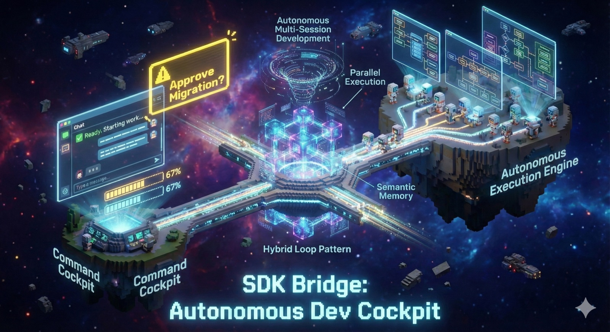

# SDK Bridge



[](https://github.com/flight505/sdk-bridge)
[](LICENSE)
[](https://github.com/anthropics/claude-code)

**PRD-driven parallel development.** SDK Bridge turns your feature description into a structured PRD, then orchestrates multiple Claude Code Agent Teams teammates to implement stories simultaneously — with TDD discipline, quality gates, and two-stage review baked in.

One command. Parallel execution. No babysitting.

> Based on [Geoffrey Huntley's Ralph pattern](https://ghuntley.com/ralph/).

---

## How It Works

```
You: /sdk-bridge:start
  ↓
Wizard: Ask 3-5 questions → generate tasks/prd-feature.md
  ↓
Review: Approve, improve, or edit the PRD
  ↓
Convert: prd.json + dependency graph analysis
  "Group 1: US-001 (no deps)
   Group 2: US-002, US-003 (parallel — both depend on US-001)
   Group 3: US-004 (depends on US-002 + US-003)
   Suggested teammates: 2"
  ↓
Configure: quality commands (test/build/typecheck) + code review
  ↓
Execute:
  git checkout -b sdk-bridge/your-feature
  TaskCreate × N stories
  ┌─────────────────────────────────────────────────────┐
  │  Teammate 1          Teammate 2          Teammate N  │
  │  claim US-001        claim US-002        claim US-003│
  │  TDD → commit        TDD → commit        TDD → commit│
  │  TaskUpdate(done)    TaskUpdate(done)    TaskUpdate  │
  └─────────────────────────────────────────────────────┘
  validate-task.sh fires on each TaskCompleted
  check-idle.sh blocks any teammate from stopping early
  ↓
Review: reviewer subagent → full branch diff vs all criteria
        code-reviewer subagent → architecture, security, types
  ↓
Done: prd.json marked complete · progress.jsonl updated · report
```

---

## Prerequisites

| Requirement | Version | Install |
|------------|---------|---------|
| [Claude Code CLI](https://code.claude.com) | v2.1.32+ | See Claude Code docs |
| Agent Teams | Experimental | `export CLAUDE_CODE_EXPERIMENTAL_AGENT_TEAMS=1` |
| `jq` | Any | `brew install jq` (macOS) or `apt install jq` |
| Git | Any | Required for branch management |

**Permissions:** For autonomous execution (no permission prompts), start Claude Code with one of:

```bash
# Team/Enterprise plans — safer, uses background classifier
claude --permission-mode auto

# Max/Pro plans — skips all permission checks
claude --dangerously-skip-permissions
```

Without either, teammates inherit your default permission mode and will prompt for every file edit, bash command, and git operation. The `permissionMode` declared in agent frontmatter is overridden for Agent Teams teammates. Auto mode requires Team/Enterprise plan + Sonnet 4.6 or Opus 4.6.

**Authentication (choose one):**

```bash
# OAuth (recommended for Max subscribers)
claude setup-token
export CLAUDE_CODE_OAUTH_TOKEN='your-token'

# API key
export ANTHROPIC_API_KEY='your-key'
```

---

## Installation

```bash
# Add the marketplace
/plugin marketplace add flight505/flight505-marketplace

# Install SDK Bridge
/plugin install sdk-bridge@flight505-marketplace
```

---

## Quick Start

```bash
# Enable Agent Teams (add to ~/.zshrc or ~/.bashrc)
export CLAUDE_CODE_EXPERIMENTAL_AGENT_TEAMS=1

# Start the wizard
/sdk-bridge:start
```

The wizard walks you through 5 checkpoints (dependency check → PRD generation → review → conversion → configuration), then takes over as team lead and runs Agent Teams until all stories are complete.

---

## Architecture


### Components

| Component | Count | Description |
|-----------|-------|-------------|
| Commands | 1 | `/sdk-bridge:start` — interactive wizard + team lead |
| Skills | 2 | PRD generator, PRD converter (with dependency graph) |
| Agents | 3 | implementer (teammate), reviewer, code-reviewer |
| Hooks | 5 | `TaskCreated`, `TaskCompleted`, `TeammateIdle`, `SessionStart`, `PreCompact` |

### Agents

**Implementer** (teammate, runs in parallel)
- Claims stories from shared task list via `TaskList` / `TaskUpdate`
- Implements with strict TDD: RED → GREEN → REFACTOR per criterion
- Appends patterns to `progress.jsonl` to share knowledge with other teammates
- Marks task complete; `validate-task.sh` hook blocks on test/build/typecheck failure

**Reviewer** (subagent, runs once after all stories complete)
- Reads full `git diff main...HEAD` across all commits
- Verifies every acceptance criterion in every story with file:line evidence
- Two-phase: spec compliance first, then runs configured quality commands

**Code Reviewer** (subagent, opt-in, runs after reviewer approves)
- Adversarial full-branch diff review
- Checks architecture, security, type safety, test quality, performance
- Returns structured verdict with file:line issue references

### Hooks

| Hook | Event | Behaviour |
|------|-------|-----------|
| `validate-task-name.sh` | `TaskCreated` | Validates task subjects follow `[US-XXX]:` format; exit 2 blocks creation |
| `validate-task.sh` | `TaskCompleted` | Runs `test_command`, `build_command`, `typecheck_command`; exit 2 sends feedback back to teammate |
| `check-idle.sh` | `TeammateIdle` | Checks `prd.json` for incomplete stories; exit 2 keeps teammate working |
| `inject-context.sh` | `SessionStart` | Injects PRD progress summary into session context |
| `preserve-context.sh` | `PreCompact` | Re-injects current story + patterns before context compaction |

---

## Configuration

The wizard creates `.claude/sdk-bridge.config.json` automatically. Edit it directly to tune:

```json
{
  "max_teammates": 5,
  "branch_prefix": "sdk-bridge",
  "test_command": "npm test",
  "build_command": "npm run build",
  "typecheck_command": "tsc --noEmit",
  "code_review": true
}
```

| Field | Default | Description |
|-------|---------|-------------|
| `max_teammates` | `5` | Concurrent implementers. Calculated as `min(max_teammates, parallel_story_groups)` |
| `branch_prefix` | `"sdk-bridge"` | All feature branches created as `{prefix}/{feature-name}` |
| `test_command` | `""` | Runs after each story via `TaskCompleted` hook |
| `build_command` | `""` | Runs after each story via `TaskCompleted` hook |
| `typecheck_command` | `""` | Runs after each story via `TaskCompleted` hook |
| `code_review` | `true` | Spawn code-reviewer subagent after all stories and reviewer complete |

---

## State Files

SDK Bridge uses three files in your project root as source of truth:

| File | Purpose | Format |
|------|---------|--------|
| `prd.json` | Stories + completion status | JSON — modified by implementers |
| `tasks/prd-{feature}.md` | Human-readable PRD | Markdown — created by prd-generator |
| `progress.jsonl` | Patterns and learnings per story | JSON lines — append-only |
| `.claude/sdk-bridge.config.json` | Run configuration | JSON |

### prd.json Schema

```json
{
  "project": "MyApp",
  "branchName": "sdk-bridge/feature-name",
  "description": "Feature description",
  "userStories": [
    {
      "id": "US-001",
      "title": "Story title",
      "description": "As a..., I want..., so that...",
      "acceptanceCriteria": ["Criterion 1", "Typecheck passes"],
      "priority": 1,
      "passes": false,
      "depends_on": [],
      "related_to": [],
      "implementation_hint": "",
      "check_before_implementing": ["grep -rn 'Thing' src/"]
    }
  ]
}
```

---

## Quality Gates

Every story passes through multiple quality checks before it can be marked complete:

1. **TDD enforcement** — implementer must write failing tests before code (RED-GREEN-REFACTOR)
2. **`validate-task.sh`** — runs `typecheck_command`, `build_command`, `test_command` on `TaskCompleted`; exit 2 sends failure output back as feedback so the teammate fixes and retries
3. **`check-idle.sh`** — on `TeammateIdle`, counts remaining stories and blocks shutdown if any are incomplete
4. **Reviewer** — after all stories, compares full branch diff against every acceptance criterion with file:line evidence
5. **Code reviewer** (opt-in) — adversarial quality pass: security, types, architecture, regressions

---

## Watchdog

If a run crashes or gets interrupted:

```bash
bash ${CLAUDE_PLUGIN_ROOT}/scripts/watchdog.sh
```

Output:

```
SDK Bridge Status: MyApp
Branch: sdk-bridge/task-priority
Progress: 2/4 stories complete

Incomplete stories:
  - US-003: Add priority selector to task edit
  - US-004: Filter tasks by priority

To resume: run /sdk-bridge:start — it will detect the existing prd.json and continue.
```

---

## Monitoring

SDK Bridge offers to set up `/loop` monitoring automatically after spawning teammates. You can also set it up manually:

```bash
# Automatic progress updates every 5 minutes (works in the same session)
/loop 5m Use TaskList to check SDK Bridge progress and report completed/total stories

# One-time status check (useful outside a session or after a crash)
bash ${CLAUDE_PLUGIN_ROOT}/scripts/watchdog.sh
```

`/loop` runs a prompt on a recurring interval within your session. It fires between turns, checks task status, and reports progress without you having to ask. Session-scoped — gone when you exit. Requires Claude Code v2.1.71+. See [Scheduled Tasks](https://code.claude.com/docs/en/scheduled-tasks) for details.

---

## Debugging

```bash
# Story status
cat prd.json | jq '.userStories[] | {id, title, passes}'

# View patterns and learnings
cat progress.jsonl | jq .

# Git history
git log --oneline

# Check dependencies
bash ${CLAUDE_PLUGIN_ROOT}/scripts/check-deps.sh

# Crash recovery
bash ${CLAUDE_PLUGIN_ROOT}/scripts/watchdog.sh
```

---

## Differences from v6

| v6 (bash loop) | v7 (Agent Teams) |
|---------------|-----------------|
| Sequential — one story at a time | Parallel — N teammates simultaneously |
| `sdk-bridge.sh` bash loop | Inline orchestration in `/sdk-bridge:start` |
| `SubagentStop` validation gate | `TaskCompleted` hook validation gate |
| Worktree isolation per story | Shared filesystem, task coordination via `TaskList/TaskUpdate` |
| `progress.txt` (plain text) | `progress.jsonl` (JSON lines, machine-readable) |
| 5 agents, 6 hooks, 3 skills | 3 agents, 4 hooks, 2 skills |
| Per-story review | Full-branch review after all stories |
| Config: iterations, timeout, mode, model | Config: max_teammates, commands, code_review |

---

## References

- [Claude Code CLI](https://code.claude.com/docs/en/cli-reference.md)
- [Claude Code Agent Teams](https://code.claude.com/docs/en/agent-teams.md)
- [Claude Code Hooks](https://code.claude.com/docs/en/hooks.md)
- [Plugin Development](https://github.com/anthropics/claude-code/blob/main/docs/plugins.md)
- [Geoffrey Huntley's Ralph](https://ghuntley.com/ralph/)

---

MIT © Jesper Vang
